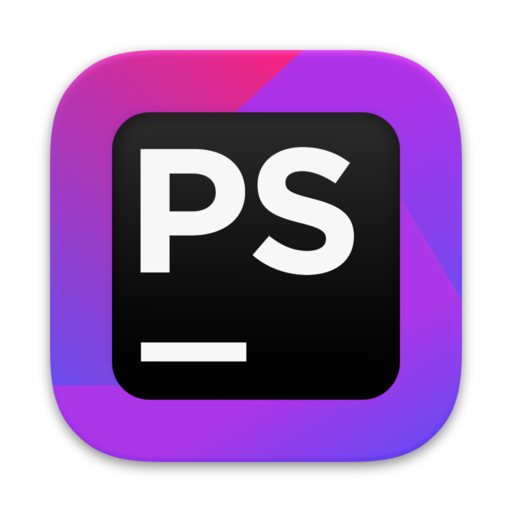
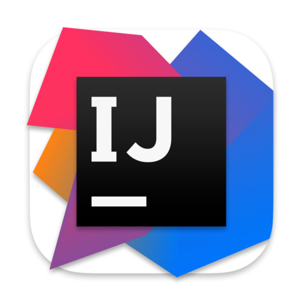

<h2>Приветствую 👋 Меня зовут Алексей! Я backend-разработчик PHP & Golang.</h2>

**Для меня бэкэнд-разработка — это не просто написание строк кода; это форма искусства. Речь идет о создании систем, которые выдерживают испытание временем, балансируют между сложностью и простотой и находят красоту в гармонии компонентов. Речь идет о формировании основы приложений, обеспечении бесперебойного взаимодействия и процветании бизнеса.**

### Заходите на мой канал:

### [**Башня байткода: заметки об архитектуре ПО**](https://t.me/softwaretower)

### Вы также можете связаться со мной через:

### Языки программирования и Основной инструментарий:

                

### Статистика

